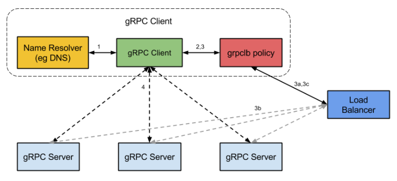

## 负载均衡(Load Balance)
负载均衡可以将工作任务分摊到多个处理单元，从而提高并发处理能力。
常见的web负载均衡技术包括：DNS轮询、IP负载均衡和CDN。其中IP负载均衡可以使用硬件设备或软件方式来实现。

- 服务器集群(Cluster)使得多个服务器节点能够协同工作，根据目的的不同，服务器集群可以分为：
- 高性能集群：将单个重负载的请求分散到多个节点进行处理，最后再将处理结果进行汇总
- 高可用集群：提高冗余单元，避免单点故障
- 负载均衡集群：将大量的并发请求分担到多个处理节点。由于单个处理节点的故障不影响整个服务，负载均衡集群同时也实现了高可用性。
一般提到的负载均衡(Load Balance)，是指实现负载均衡集群。负载均衡实现了横向扩展（Scale Out），避免纵向的升级（Scale Up）换代。
这里的web负载均衡，特指能够分担web请求（http，https等）的负载均衡技术。

如果没有使用负载均衡，用户直连服务器，如果链路故障或者服务器宕机，业务会受到影响。

！[传统组网](non-balance.jpg)

如果在后端引入一个负载均衡器和其他的web服务器，可以提升组网的稳定性。

负载均衡的意义在于，让所有节点以最小的代价、最好的状态对外提供服务，这样系统吞吐量最大，性能更高，对于用户而言请求的时间也更小。而且，负载均衡增强了系统的可靠性，最大化降低了单个节点过载、甚至crash的概率。不难想象，如果一个系统绝大部分请求都落在同一个节点上，那么这些请求响应时间都很慢，而且万一节点降级或者崩溃，那么所有请求又会转移到下一个节点，造成雪崩。

## 负载均衡处理的请求

负载均衡器的管理员能主要为下面四种主要类型的请求设置转发规则： 

* HTTP 
* HTTPS 
* TCP 
* UDP
  
## 负载均衡常用方案

常见互联网分布式架构如上，分为客户端层、反向代理nginx层、站点层、服务层、数据层。
可以看到，每一个下游都有多个上游调用，只需要做到，每一个上游都均匀访问每一个下游，就能实现“将请求/数据【均匀】分摊到多个操作单元上执行”；也就是负载均衡。

七层负载均衡工作在OSI模型的应用层，因为它需要解析应用层流量，所以七层负载均衡在接到客户端的流量以后，还需要一个完整的TCP/IP协议栈。七层负载均衡会与客户端建立一条完整的连接并将应用层的请求流量解析出来，再按照调度算法选择一个应用服务器，并与应用服务器建立另外一条连接将请求发送过去，因此七层负载均衡的主要工作就是代理。

### 软件均衡

- 【客户端层】到【反向代理层】的负载均衡，是通过“DNS轮询”实现的：DNS-server对于一个域名配置了多个解析ip，每次DNS解析请求来访问DNS-server，会轮询返回这些ip，保证每个ip的解析概率是相同的。这些ip就是nginx的外网ip，以做到每台nginx的请求分配也是均衡的。

- 【反向代理层】到【站点层】的负载均衡，是通过“nginx”实现的。通过修改nginx.conf，可以实现多种负载均衡策略：
1)请求轮询：和DNS轮询类似，请求依次路由到各个web-server
2)最少连接路由：哪个web-server的连接少，路由到哪个web-server
3)ip哈希：按照访问用户的ip哈希值来路由web-server，只要用户的ip分布是均匀的，请求理论上也是均匀的，ip哈希均衡方法可以做到，同一个用户的请求固定落到同一台web-server上，此策略适合有状态服务，例如session(备注：可以这么做，但强烈不建议这么做，站点层无状态是分布式架构设计的基本原则之一，session最好放到数据层存储)

- 【站点层】到【服务层】的负载均衡，是通过“服务连接池”实现的。
上游连接池会建立与下游服务多个连接，每次请求会“随机”选取连接来访问下游服务。

- 【数据层】的负载均衡
在数据量很大的情况下，由于数据层(db，cache)涉及数据的水平切分，所以数据层的负载均衡更为复杂一些，它分为“数据的均衡”，与“请求的均衡”。
数据的均衡是指：水平切分后的每个服务(db，cache)，数据量是差不多的。
请求的均衡是指：水平切分后的每个服务(db，cache)，请求量是差不多的。

>水平切分的方式：
>按照range水平切分，每一个数据服务，存储一定范围的数据（规则简单，均衡较好，拓展简单，请求的负载不一定均衡，新用户比老用户更活跃，大范围的请求压力大）
>按照id哈希水平切分，每一个数据服务，存储某个key值hash后的部分数据(规则简单，均衡和均匀都好，不易拓展)

### 硬件均衡

F5的全称是F5-BIG-IP-GTM，是最流行的硬件负载均衡设备，其并发能力达到百万级

- 多链路的负载均衡和冗余
- 防火墙负载均衡
- 服务器负载均衡
- 高可用
- 安全性
- 易于管理
- SSL加速、软件升级、IP地址过滤、带宽控制等辅助功能。

### 方案总结

负载均衡(Load Balance)是分布式系统架构设计中必须考虑的因素之一，它通常是指，将请求/数据【均匀】分摊到多个操作单元上执行，负载均衡的关键在于【均匀】。

- [x] 【客户端层】到【反向代理层】的负载均衡，是通过**“DNS轮询”**实现的
  
- [x] 【反向代理层】到【站点层】的负载均衡，是通过**“nginx”**实现的

- [x] 【站点层】到【服务层】的负载均衡，是通过**“服务连接池”**实现的

- [x] 【数据层】的负载均衡，要考虑<b>“数据的均衡”</b>与<b>“请求的均衡”</b>两个点，常见的方式有<b>“按照范围水平切分”</b>与<b>“hash水平切分”</b>

## 负载均衡常用算法

负载均衡器一般根据两个因素来决定要将请求转发到哪个服务器。首先，确保所选择的服务器能够对请求做出响应，然后根据预先配置的规则从健康服务器池（healthy pool）中进行选择。

因为，负载均衡器应当只选择能正常做出响应的后端服务器，因此就需要有一种判断后端服务器是否「健康」的方法。为了监视后台服务器的运行状况，运行状态检查服务会定期尝试使用转发规则定义的协议和端口去连接后端服务器。如果，服务器无法通过健康检查，就会从池中剔除，保证流量不会被转发到该服务器，直到其再次通过健康检查为止。

- 　  第一，是否意识到不同节点的服务能力是不一样的，比如CPU、内存、网络、地理位置
- 　　第二，是否意识到节点的服务能力是动态变化的，高配的机器也有可能由于一些突发原因导致处理速度变得很慢
- 　　第三，是否考虑将同一个客户端，或者说同样的请求分发到同一个处理节点，这对于“有状态”的服务非常重要，比如session，比如分布式存储
- 　　第四，谁来负责负载均衡，即谁充当负载均衡器（load balancer），balancer本身是否会成为瓶颈

---
**四层负载均衡工作在OSI模型的传输层，主要工作是转发，它在接收到客户端的流量以后通过修改数据包的地址信息将流量转发到应用服务器。**

>NAT（Network Address Translation，网络地址转换）也叫做网络掩蔽或者IP掩蔽，是将IP 数据包头中的IP 地址转换为另一个IP 地址的过程。
NAT能够将私有（保留）地址转化为合法IP地址，通常用于一个公共IP地址和多个内部私有IP地址直接的映射，广泛应用于各种类型Internet接入方式和各种类型的网络中。
通过使用NAT将目的地址转换到多个服务器的方式，可以实现负载均衡，同时能够隐藏并保护内部服务器，避免来自网络外部的攻击。商用负载均衡设备如Cisco的LocalDirector、F5的Big/IP和Alteon的ACEDirector都是基于NAT方法。
VS/NAT(Virtual Server via Network Address Translation)是基于NAT技术实现负载均衡的方法。

>IP Tunneling(IP隧道)技术，又称为IP封装技术(IP encapsulation)，是一种在网络之间传递数据的方式。可以将一个IP报文封装到另一个IP报文（可能是不同的协议）中，并转发到另一个IP地址。IP隧道主要用于移动主机和虚拟私有网络（Virtual Private Network），在其中隧道都是静态建立的，隧道一端有一个IP地址，另一端也有唯一的IP地址。
VS/TUN（Virtual Server via IP Tunneling）是基于隧道技术实现负载均衡的方法。

>DR(Direct Routing, 直接路由), 路由器学习路由的方法之一。路由器对于自己的网络接口所直连的网络之间的通信，可以自动维护路由表，而且不需要进行路由计算。
直接路由通常用在一个三层交换机连接几个VLAN的情况，只要设置直接路由VLAN之间就可以通信，不需要设置其他的路由方式。
VS/DR(Virtual Server via Direct Routing)是基于直接路由实现负载均衡的方法

>VS/FULLNAT是为了解决这些不足而新开发的一种转发模式。VS/FULLNAT的特点是：
调度器和服务器可以跨VLAN通信，不需要配置在同一个网段
请求和应答报文都经过调度器，服务器不需要绑定虚拟IP
---

### Round Robin（轮询）

为第一个请求选择列表中的第一个服务器，然后按顺序向下移动列表直到结尾，然后循环。 

### weight round-robin（加权轮询算法）

加权轮训算法就是在轮训算法的基础上，考虑到机器的差异性，分配给机器不同的权重，能者多劳。注意，这个权重的分配依赖于请求的类型，比如计算密集型，那就考虑CPU、内存；如果是IO密集型，那就考虑磁盘性能。

### random（随机算法/加权随机算法）

随机选择一个节点服务，按照概率，只要请求数量足够多，那么也能达到绝对均衡的效果

### Least Connections（最小连接）

优先选择连接数最少的服务器，在普遍会话较长的情况下推荐使用。 

### Source（源端IP散列）

根据请求源的 IP 的散列（hash）来选择要转发的服务器。这种方式可以一定程度上保证特定用户能连接到相同的服务器。

如果你的应用需要处理状态而要求用户能连接到和之前相同的服务器。可以通过 Source 算法基于客户端的 IP 信息创建关联，或者使用粘性会话（sticky sessions）。

**哈希算法的缺陷**
很明显，当节点的数目发生变化的时候，请求会大概率分配到其他的节点，引发到一系列问题，比如sticky session。而且在某些情况，比如分布式存储，是绝对的不允许的。

这里提出*一致性哈希算法*，就是一个物理节点与多个虚拟节点映射，在hash的时候，使用虚拟节点数目而不是物理节点数目。当物理节点变化的时候，虚拟节点的数目无需变化，只涉及到虚拟节点的重新分配。而且，调整每个物理节点对应的虚拟节点数目，也就相当于每个物理节点有不同的权重

### 负载均衡器的备份
当主负载均衡器发生了故障，就需要将用户请求转到第二个负载均衡器。因为 DNS 更改通常会较长的时间才能生效，因此需要能灵活解决 IP 地址重新映射的方法，比如浮动 IP（floating IP）。这样域名可以保持和相同的 IP 相关联，而 IP 本身则能在服务器之间移动。

### 负载均衡效果

！[动态均衡演示](ex-balance.gif)

### 负载均衡的优化

同一个请求是否分发到同样的服务节点，同一个请求指的是同一个用户或者同样的唯一标示。什么时候同一请求最好（必须）分发到同样的服务节点呢？那就是有状态 -- 请求依赖某些存在于内存或者磁盘的数据，比如web请求的session，比如分布式存储。怎么实现呢，

- （1）请求分发的时候，保证同一个请求分发到同样的服务节点。
　　这个依赖于负载均衡算法，比如简单的轮训，随机肯定是不行的，哈希法在节点增删的时候也会失效。可行的是一致性hash，以及分布式存储中的按范围分段（即记录哪些请求由哪个服务节点提供服务），代价是需要在load balancer中维护额外的数据。
- 　（2）状态数据在backend servers之间共享
　　保证同一个请求分发到同样的服务节点，这个只是手段，目的是请求能使用到对应的状态数据。如果状态数据能够在服务节点之间共享，那么也能达到这个目的。比如服务节点连接到共享数据库，或者内存数据库如memcached
- 　（3）状态数据维护在客户端
　　这个在web请求中也有使用，即cookie，不过要考虑安全性，需要加密。

#### 负载均衡器

关于load balancer，其实就是说，在哪里做负载均衡，是客户端还是服务端，是请求的发起者还是请求的3。具体而言，要么是在客户端，根据服务节点的信息自行选择，然后将请求直接发送到选中的服务节点；要么是在服务节点集群之前放一个集中式代理（proxy），由代理负责请求求分发。不管哪一种，至少都需要知道当前的服务节点列表这一基础信息。
　　如果在客户端实现负载均衡，客户端首先得知道服务器列表，要么是静态配置，要么有简单接口查询，但backend server的详细负载信息，就不适用通过客户端来查询。因此，客户端的负载均衡算法要么是比较简单的，比如轮训（加权轮训）、随机（加权随机）、哈希这几种算法，只要每个客户端足够随机，按照大数定理，服务节点的负载也是均衡的。要在客户端使用较为复杂的算法，比如根据backend的实际负载，那么就需要去额外的负载均衡服务（external load balancing service）查询到这些信息，在grpc中，就是使用的这种办法

　可以看到，load balancer与grpc server通信，获得grpc server的负载等具体详细，然后grpc client从load balancer获取这些信息，最终grpc client直连到被选择的grpc server。
　　而基于Proxy的方式是更为常见的，比如7层的Nginx，四层的F5、LVS，既有硬件路由，也有软件分发。集中式的特点在于方便控制，而且能容易实现一些更精密，更复杂的算法。但缺点也很明显，一来负载均衡器本身可能成为性能瓶颈；二来可能引入额外的延迟，请求一定先发到达负载均衡器，然后到达真正的服务节点。
　　load balance proxy对于请求的响应（response），要么不经过proxy(三角传输模式)，如LVS；要么经过Proxy，如Nginx。下图是LVS示意图

！[rpc-lvs](rpc-lvs.png)

而如果response也是走load balancer proxy的话，那么整个服务过程对客户端而言就是完全透明的，也防止了客户端去尝试连接后台服务器，提供了一层安全保障！
　　值得注意的是，load balancer proxy不能成为单点故障（single point of failure），因此一般会设计为高可用的主从结构

---

负载均衡是一种**推**模型，一定会选出一个服务节点，然后把请求推送过来。
而换一种思路，使用消息队列，就变成了**拉**模型：空闲的服务节点主动去拉取请求进行处理，各个节点的负载自然也是均衡的。消息队列相比负载均衡好处在于，服务节点不会被大量请求冲垮，同时增加服务节点更加容易；缺点也很明显，请求不是事实处理的。

参考链接：[关于负载均衡的一切](https://www.cnblogs.com/xybaby/p/7867735.html)

## 版本控制

| Version | Action                   | Time       |
| ------- | ------------------------ | ---------- |
| 1.0     | Init                     | 2019-04-25T07:04:20-07:00|
