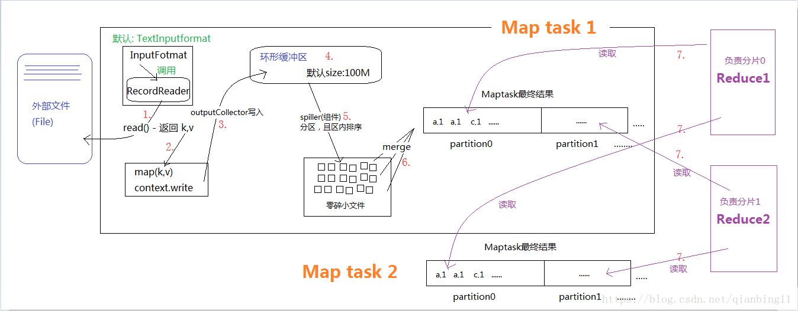
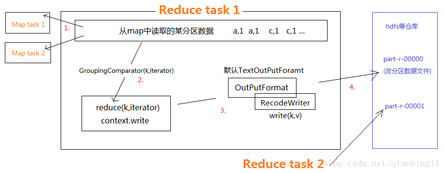

## MapReduce(并行运算编程模型)基础概念
MapReduce是一种编程模型，用于大规模数据集（大于1TB）的并行运算。概念"Map（映射）"和"Reduce（归约）"，是它们的主要思想.软件实现是指定一个Map（映射）函数，用来把一组键值对映射成一组新的键值对，指定并发的Reduce（归约）函数，用来保证所有映射的键值对中的每一个共享相同的键组。

## 特点(分而治之)
- 映射和化简
    把一个数据集合映射缩小之后，事实上，每个元素都是被独立操作的，而原始列表没有被更改，因为这里创建了一个新的列表来保存新的答案。这就是说，Map操作是可以高度并行的，这对高性能要求的应用以及并行计算领域的需求非常有用。 而化简操作指的是对一个列表的元素进行适当的合并，同样也可以并行运算，因为数据运算的过程是相对独立的。
- 分布可靠
    MapReduce通过把对数据集的大规模操作分发给网络上的每个节点实现可靠性；每个节点会周期性的返回它所完成的工作和最新的状态。如果一个节点保持沉默超过一个预设的时间间隔，主节点（类同Google File System中的主服务器）记录下这个节点状态为死亡，并把分配给这个节点的数据发到别的节点。每个操作使用命名文件的原子操作以确保不会发生并行线程间的冲突；当文件被改名的时候，系统可能会把他们复制到任务名以外的另一个名字上去。（避免副作用）。 化简操作工作方式与之类似，但是由于化简操作的可并行性相对较差，主节点会尽量把化简操作只分配在一个节点上，或者离需要操作的数据尽可能近的节点上
- MapReduce会生成大量的临时文件
- 为应用开发者隐藏系统层细节
- 平滑无缝的可扩展性 这里指出的可扩展性主要包括两层意义上的扩展性：数据扩展和系统规模扩展性。
- 难以实时计算（MapReduce处理的是存储在本地磁盘上的离线数据）
- 不能流式计算（MapReduce设计处理的数据源是静态的）
- 难以DAG计算MapReduce这些并行计算大都是基于非循环的数据流模型，也就是说，一次计算过程中，不同计算节点之间保持高度并行，这样的数据流模型使得那些需要反复使用一个特定数据集的迭代算法无法高效地运行。

## 实现框架

### MapTask

1. 程序内的InputFormat(默认实现类TextInputFormat)来读取外部数据，它会调用RecordReader(它的成员变量)的read()方法来读取，返回k,v键值对。
2. 读取的k,v键值对传送给map()方法，作为其入参来执行用户定义的map逻辑
3. context.write方法被调用时，outputCollector组件会将map()方法的输出结果写入到环形缓冲区内。
4. 环形缓冲区其实就是一个数组，后端不断接受数据的同时，前端数据不断被溢出，长度用完后读取的新数据再从前端开始覆盖。这个缓冲区默认大小100M，可以通过MR.SORT.MB(应该是它)配置
5. spiller组件会从环形缓冲区溢出文件，这过程会按照定义的partitioner分区(默认是hashpartition),根据reduce任务的数目将数据划分为相同数目的分区，也就是一个reduce任务对应一个分区的数据，并且按照key.compareTo进行排序(底层主要用快排和外部排序)，若有combiner也会执行combiner。spiller的不断工作，会不断溢出许多小文件。这些文件仍在map task所处机器上。
6. 小文件执行merge(合并)，行程分区且区内有序的大文件(归并排序，会再一次调用combiner)
7. Reduce会根据自己的分区，去所有map task中，从文件读取对应的数据。
8. 有人可能会问：分区中的数据怎么知道它对应的reduce是哪个呢？其实map任务一直和其父TaskTracker保持联系，而TaskTracker又一直和JobTracker保持心跳。所以JobTracker中保存了整个集群中的宏观信息

### ReduceTask

1. reduce task通过网络向map task获取某一分区的数据。如果reduce端接受的数据量相当小，则直接存储在内存中（缓冲区大小由mapred.job.shuffle.input.buffer.percent属性控制，表示用作此用途的堆空间的百分比），如果数据量超过了该缓冲区大小的一定比例（由mapred.job.shuffle.merge.percent决定），则对数据合并后溢写到磁盘中。
2. 通过GroupingComparator()分辨同一组的数据，把他们发送给reduce(k,iterator)方法(这里多个数据合成一组时，只取其中一个key，取得是第一个)。
3. 调用context.write()方法，会让OutPurFormat调用RecodeWriter的write()方法将处理结果写入到数据仓库中。写出的只有一个分区的文件数据，如图。
4. 其中map的context.write()调用后，开始聚合数据写入到reduce的过程叫做Shuffle

## 展望

- 在面试过程中，不管是频率统计还是topK问题，这些都意味着化简规约为MapReduce问题。
- bloom过滤器，利用二进制置位来进行筛选，但是它对已经存在的识别不一定准确，如果特征未出现则一定能识别

## 版本控制

| Version | Action                   | Time       |
| ------- | ------------------------ | ---------- |
| 1.0     | Init                     | 2019-04-25T03:51:49-07:00|
