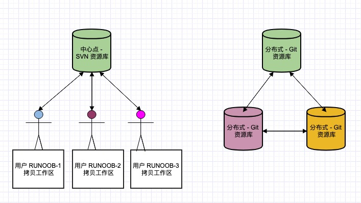

## Devops = "Development" + "Operations"
DevOps 是一个完整的面向IT运维的工作流，以 IT 自动化以及持续集成（CI）、持续部署（CD）为基础，来优化程式开发、测试、系统运维等所有环节。 

在敏捷开发的基础上，提出开发与运营之间的软件版本迭代循环。

### 工具链
 - 代码管理（SCM）：GitHub、GitLab、BitBucket、SubVersion
 - 构建工具：Ant、Gradle、maven
 - 自动部署：Capistrano、CodeDeploy
 - 持续集成（CI）：Bamboo、Hudson、Jenkins
 - 配置管理：Ansible、Chef、Puppet、SaltStack、ScriptRock GuardRail
 - 容器：Docker、LXC、第三方厂商如AWS
 - 编排：Kubernetes、Core、Apache Mesos、DC/OS
 - 服务注册与发现：Zookeeper、etcd、Consul
 - 脚本语言：python、ruby、shell
 - 日志管理：ELK、Logentries
 - 系统监控：Datadog、Graphite、Icinga、Nagios
 - 性能监控：AppDynamics、New Relic、Splunk
 - 压力测试：JMeter、Blaze Meter、loader.io
 - 预警：PagerDuty、pingdom、厂商自带如AWS SNS
 - HTTP加速器：Varnish
 - 消息总线：ActiveMQ、SQS
 - 应用服务器：Tomcat、JBoss
 - Web服务器：Apache、Nginx、IIS
 - 数据库：MySQL、Oracle、PostgreSQL等关系型数据库；cassandra、mongoDB、redis等NoSQL数据库
 - 项目管理（PM）：Jira、Asana、Taiga、Trello、Basecamp、Pivotal Tracker

## git-flow

**Git与Svn**

1. Git 是分布式的，SVN 不是：这是 Git 和其它非分布式的版本控制系统，例如 SVN，CVS 等，最核心的区别。
2. Git 把内容按元数据方式存储，而 SVN 是按文件：所有的资源控制系统都是把文件的元信息隐藏在一个类似 .svn、.cvs 等的文件夹里。
3. Git 分支和 SVN 的分支不同：分支在 SVN 中一点都不特别，其实它就是版本库中的另外一个目录。
4. Git 没有一个全局的版本号，而 SVN 有：目前为止这是跟 SVN 相比 Git 缺少的最大的一个特征。
5. Git 的内容完整性要优于 SVN：Git 的内容存储使用的是 SHA-1 哈希算法。这能确保代码内容的完整性，确保在遇到磁盘故障和网络问题时降低对版本库的破坏



### 什么是git-flow
Git Flow 是前人经过探索总结出来的一套Git分支管理规范和流程。

在多组员，多项目等环境进行协同工作时，如果没有统一规范、统一流程，则会导致额外的工作量，甚至会做无用功。所以要减少版本冲突，减轻不必要的工作，就需要规范化的工作流程。

### git-flow框架


**分支介绍**
- master 分支 
master 分支上保存生成环境发布版本的代码，这个分支不进行commit修改，只能从其它分支合并，并且每次合并都打上发布的版本号，如上图所示，v0.1是项目初始化

- develop 分支  
develop 分支从master新建的一个分支，是我们的主开发分支，本分支包含下一个要发布的版本的所有代码。这个分支一般也不进行commit修改，主要从feature分支合并。

- feature 分支 
feature分支都是从develop分支新建，主要用来开发新功能，每个功能新开一个feature，保证功能的独立性。

- release 分支 
release 分支是用来打包测试使用，当要发布的功能都从相应的feature分支合并到develop分支上后，从develop分支新建release分支，如果测试过程中发现bug，在本分支上修复，确定后打包发布，同时合并到develop和master，打上标签保存。release 就可以删掉了，也可以选择不删掉此分支。

- hotfix 分支 
hotfix是用来修复上线版本BUG使用，从master分支新建，如上图，从v0.1新建了一个hotfix，修复后合并到master和develop，并且打上相应标签。

### 使用git-flow开发

1. 在master分支上初始化项目，加入.gitignore，产生master(1)
2. 从master(1)新建develop分支，产生develop(1)
3. 从develop(1)新建feature2分支 
4. 从develop(2)新建feature1分支
5. feature1分支是第一个版本要开发的功能，在feature1(2)开发完毕，这个时候需要合并到develop分支，进入release阶段，合并后产生develop(4)，这个时候就可以吧feature1分支删掉了
6. 从develop(4)新建release分支，产生release(1)，打包后给测试人员测试，然后修复测试出的bug，修复commit后产生release(2)
7. 把release(2)打包发布1.0版本后，保存1.0版本到master，保证后面需要修复线上bug能快速找到源码。合并到develop分支，产生develop(5)，合并到develop是为了保证下一个release版本包含release(2)那些代码。分别合并后，可以选择是否删掉release分支，如果不删，也不能再在此分支上进行后续开发，后续开发只能新建分支来完成
8. 到此，一个完整的开发到发布的流程已完成，你可以继续下一个版本的开发，从develop(5)新建一个feature3分支

### 使用git-flow维护
1. 创建hotfix分支
2. 修改bug
3. 完成修复，合并到master发布
4. 打标签
5. 合并到develop

#### 版本号
版本格式：主版本号.次版本号.修订号，版本号递增规则如下：
- 主版本号：当你做了不兼容的 API 修改
- 次版本号：当你做了向下兼容的功能性新增
- 修订号：当你做了向下兼容的问题修正。

>先行版本号及版本编译信息可以加到“主版本号.次版本号.修订号”的后面，作为延伸。 
>主版本号为零（0.y.z）的软件处于开发初始阶段，一切都可能随时被改变。 
>标准的版本号必须采用 XYZ 的格式，其中 X、Y 和 Z 为非负的整数，且禁止在数字前方补零。X 是主版本号、Y 是次版本号、而 Z 为修订号。每个元素必须以数值来递增。例如：1.9.1 -> 1.10.0 -> 1.11.0。

**每次打标签后，建议将版本变更信息补充到项目wiki中**


## Git常用操作
### SSH连接
~~~shell
$ ssh-keygen -t rsa -C "your_email@youremail.com" #github上注册的邮箱
#在~/下生成.ssh文件夹，进去，打开id_rsa.pub，复制里面的key。
#回到github上，进入 Account Settings（账户配置），左边选择SSH Keys，Add SSH Key,title随便填，粘贴在你电脑上生成的key。
$ ssh -T git@github.com

The authenticity of host 'github.com (52.74.223.119)' can't be established.
RSA key fingerprint is SHA256:nThbg6kXUpJWGl7E1IGOCspRomTxdCARLviKw6E5SY8.
Are you sure you want to continue connecting (yes/no)? y
Please type 'yes' or 'no': yes
Warning: Permanently added 'github.com,52.74.223.119' (RSA) to the list of known hosts.
Hi astr0mfly! You've successfully authenticated, but GitHub does not provide shell access.
#如果是第一次的会提示是否continue，输入yes就会看到：You've successfully authenticated, but GitHub does not provide shell access 。这就表示已成功连上github。

#如果此时PUSH还是要输入密码
cd ~/.ssh

ssh-add isa_ra

#更改仓库地址为SSH形式
cd clone_path
cat .git/config #查看remote地址是https形式的
git remote rm origin
git remote add git@github.com:astr0mfly/astr0mfly.github.io.git

~~~


### 新建仓库
```shell
git init #在当前目录下生成一个 .git 目录

# 代码提交三步走
$ git add -A
$ git commit -m '初始化项目版本'
$ git push -u origin devlop
#

git clone <repo:Git 仓库> <directory:本地目录>

#SSH加密配对
git clone git@github.com:fsliurujie/test.git         --SSH协议
git clone git://github.com/fsliurujie/test.git          --GIT协议
git clone https://github.com/fsliurujie/test.git      --HTTPS协议
```
### 分支管理
~~~shell
git branch (branchname) # 创建分支
git checkout (branchname) #切换分支
git merge #合并分支--产生很多的Git-Log
git rebase
git branch -d (branchname) #删除分支

git stash  #紧急情况，保存当前工作到缓存
git stash pop #推出缓存，还原工作
git stash list #查看缓存的记录
git stash drop #丢弃缓存记录
git stash show #查看缓存diff
~~~

### commit管理
~~~shell
git cherry-pick #复制一个commit的代码改动
git reset -hard #强制刷新本地代码到初始态
git revert #回退未add提交的代码

git log --oneline --graph #查看commit历史
~~~

### 标签
重大版本发布都使用标签进行管理，方便回溯
~~~shell
git tag #查看所有标签
git tag -a <tagname> -m "标签1" #指定标签信息命令
git tag -s <tagname> -m "标签2" #PGP签名标签命令

git tag -d v1.1 #删除标签
git show v1.0 #查看此版本所修改的内容
~~~

### 添加远程库
~~~shell
git remote add [shortname] [url]
git remote #查看远程库
git fetch #刷新本地仓数据
git merge #合并本地仓和工作区的代码
git remote rm [别名] #删除远程库

~~~

### git部署
1. 安装git : `sudo apt-get install git`
2. 创建证书登录
3. 初始化Git仓库
4. 克隆仓库

## 使用心得

- 本地仓使用master分支作为干净拷贝
- 所以开发基于dev分支
- 使用TortoiseGit可以简略一些步骤，方便查看全部分支
- 如果大文件较多，就要考虑分支压缩，GIT LFS二进制替换。
- 使用git-ignore添加文本筛选
- 使用git-message统一规范化代码commit格式
- Git的操作是基于commit的，所以commit要小量，多次提交，方便回退定位。
- 遇到问题先`git status`

## 版本控制

| Version | Action                   | Time       |
| ------- | ------------------------ | ---------- |
| 1.0     | Init                     | 2019-04-24T20:24:45-07:00|
