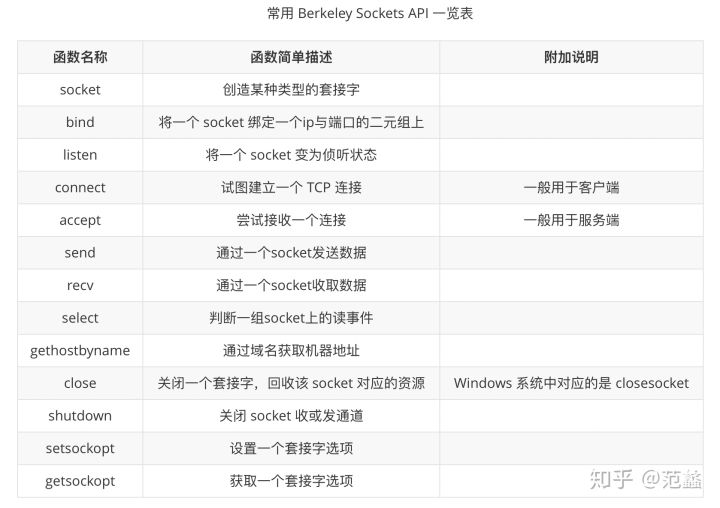
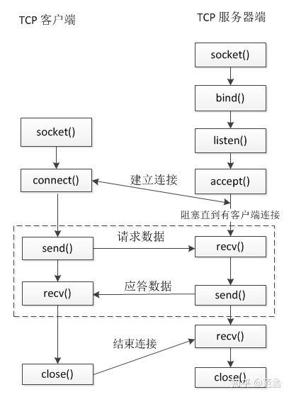

## TCP通信基本流程

Windows 和 Linux 上常用的 socket API 函数并不多，除了特定操作系统提供的一些基于自身系统特性的 API， 大多数 Socket API 都源于BSD Socket （即伯克利套接字（Berkeley Sockets）），因此这些 socket 函数在不同的平台有着相似的签名和参数。



- linux 查看socket函数帮助
  - `man bind`、`man man`、`man 3 sleep`
- windows 查看帮助
  - 使用在线版本的 MSDN

### 理论剖析

- 服务端流程
>1. 调用 socket 函数创建 socket（侦听socket）
>2. 调用 bind 函数 将 socket绑定到某个ip和端口的二元组上
>3. 调用 listen 函数 开启侦听
>4. 当有客户端请求连接上来后，调用 accept 函数接受连接，产生一个新的 socket（客户端 socket）
>5. 基于新产生的 socket 调用 send 或 recv 函数开始与客户端进行数据交流
>6. 通信结束后，调用 close 函数关闭侦听 socket
- 客户端流程
>1. 调用 socket函数创建客户端 socket
>2. 调用 connect 函数尝试连接服务器
>3. 连接成功以后调用 send 或 recv 函数开始与服务器进行数据交流
>4. 通信结束后，调用 close 函数关闭侦听socket

上述流程交互总结如下：


### 代码实现

Server
```cpp
#include <sys/types.h> 
#include <sys/socket.h>
#include <arpa/inet.h>
#include <unistd.h>
#include <iostream>
#include <string.h>

int main(int argc, char* argv[])
{
    //1.创建一个侦听socket
    int listenfd = socket(AF_INET, SOCK_STREAM, 0);
    if (listenfd == -1)
    {
        std::cout << "create listen socket error." << std::endl;
        return -1;
    }

    //2.初始化服务器地址
    struct sockaddr_in bindaddr;
    bindaddr.sin_family = AF_INET;
    bindaddr.sin_addr.s_addr = htonl(INADDR_ANY);
    bindaddr.sin_port = htons(3000);
    if (bind(listenfd, (struct sockaddr *)&bindaddr, sizeof(bindaddr)) == -1)
    {
        std::cout << "bind listen socket error." << std::endl;
        return -1;
    }

    //3.启动侦听
    if (listen(listenfd, SOMAXCONN) == -1)
    {
        std::cout << "listen error." << std::endl;
        return -1;
    }

    while (true)
    {
        struct sockaddr_in clientaddr;
        socklen_t clientaddrlen = sizeof(clientaddr);
        //4. 接受客户端连接
        int clientfd = accept(listenfd, (struct sockaddr *)&clientaddr, &clientaddrlen);
        if (clientfd != -1)
        {           
            char recvBuf[32] = {0};
            //5. 从客户端接受数据
            int ret = recv(clientfd, recvBuf, 32, 0);
            if (ret > 0) 
            {
                std::cout << "recv data from client, data: " << recvBuf << std::endl;
                //6. 将收到的数据原封不动地发给客户端
                ret = send(clientfd, recvBuf, strlen(recvBuf), 0);
                if (ret != strlen(recvBuf))
                    std::cout << "send data error." << std::endl;

                std::cout << "send data to client successfully, data: " << recvBuf << std::endl;
            } 
            else 
            {
                std::cout << "recv data error." << std::endl;
            }

            close(clientfd);
        }
    }

    //7.关闭侦听socket
    close(listenfd);

    return 0;
}

```

Client
```cpp
#include <sys/types.h> 
#include <sys/socket.h>
#include <arpa/inet.h>
#include <unistd.h>
#include <iostream>
#include <string.h>

#define SERVER_ADDRESS "127.0.0.1"
#define SERVER_PORT     3000
#define SEND_DATA       "helloworld"

int main(int argc, char* argv[])
{
    //1.创建一个socket
    int clientfd = socket(AF_INET, SOCK_STREAM, 0);
    if (clientfd == -1)
    {
        std::cout << "create client socket error." << std::endl;
        return -1;
    }

    //2.连接服务器
    struct sockaddr_in serveraddr;
    serveraddr.sin_family = AF_INET;
    serveraddr.sin_addr.s_addr = inet_addr(SERVER_ADDRESS);
    serveraddr.sin_port = htons(SERVER_PORT);
    if (connect(clientfd, (struct sockaddr *)&serveraddr, sizeof(serveraddr)) == -1)
    {
        std::cout << "connect socket error." << std::endl;
        return -1;
    }

    //3. 向服务器发送数据
    int ret = send(clientfd, SEND_DATA, strlen(SEND_DATA), 0);
    if (ret != strlen(SEND_DATA))
    {
        std::cout << "send data error." << std::endl;
        return -1;
    }

    std::cout << "send data successfully, data: " << SEND_DATA << std::endl;

    //4. 从客户端收取数据
    char recvBuf[32] = {0};
    ret = recv(clientfd, recvBuf, 32, 0);
    if (ret > 0) 
    {
        std::cout << "recv data successfully, data: " << recvBuf << std::endl;
    } 
    else 
    {
        std::cout << "recv data error, data: " << recvBuf << std::endl;
    }

    //5. 关闭socket
    close(clientfd);

    return 0;
}


```

### 演示案例

使用流程：
```shell
#编译，生成可执行文件
g++ -g -o server server.cpp
g++ -g -o client client.cpp

#启动程序
./server
./client

##客户端输出

send data successfully, data: helloworld
recv data successfully, data: helloworld

##服务端端输出
recv data from client, data: helloworld
send data to client successfully, data: helloworld


```


## 版本控制

| Version | Action                   | Time       |
| ------- | ------------------------ | ---------- |
| 1.0     | Init                     | 2019-04-29T02:47:43-07:00|
